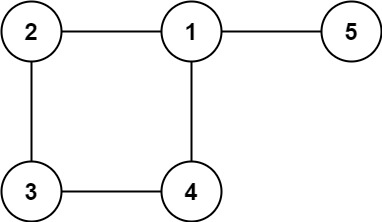

# [LeetCode #684 - Redundant Connection](https://leetcode.com/problems/redundant-connection/)

**Difficulty: `Medium`**

---

In this problem, a tree is an **undirected graph** that is connected and has no cycles.

You are given a graph that started as a tree with `n` nodes labeled from `1` to `n`, with one additional edge added. The added edge has two **different** vertices chosen from `1` to `n`, and was not an edge that already existed. The graph is represented as an array `edges` of length `n` where `edges[i] = [ai, bi]` indicates that there is an edge between nodes `ai` and `bi` in the graph.

*Return an edge that can be removed so that the resulting graph is a tree of* `n` *nodes*. If there are multiple answers, return the answer that occurs last in the input.

---

**Example 1:**  
  
Input:  
```
edges = [[1,2],[1,3],[2,3]]
```
Output:  
```
[2,3]
```

**Example 2:**  
  
Input:  
```
edges = [[1,2],[2,3],[3,4],[1,4],[1,5]]
```
Output:  
```
[1,4]
```

**Constraints:**
- `n == edges.length`
- `3 <= n <= 1000`
- `edges[i].length == 2`
- `1 <= ai < bi <= edges.length`
- `ai != bi`
- There are no repeated edges.
- The given graph is connected.

---

# [Solutions](https://github.com/Reddimus/LeetCode_Notes/tree/main/Graphs/Medium/LC_684-Redundant_Connection)

### Approach: Graphs - Disjoint Set Union (DSU) approach

#### Intuition:
When adding edges to a graph, we can use a disjoint set union (DSU) data structure to keep track of the connected components of the graph. If we add an edge that is already in the same connected component, then we have found a cycle in the graph.

#### Steps:
1. **Create a DSU data structure**:
    - Create a DSU data structure with `n` nodes, where each node is initially its own connected component. In this case `n` is the number 1-indexed nodes in the graph which is equal to the length of the `edges` array.
    - We can use an array `parent` to keep track of the parent of each node. Initially, each node is its own parent.
    - We can use an array `rank` to keep track of the rank of each node. Initially, each node has a rank of 1.
    - **Implement Find Parent function with path compression optimization**:
        - Find the parent of a node `x` by checking if `parent[x] == x`. If not, then set `parent[x] = find(parent[x])`.
        - Return `parent[x]` as the parent of node `x`.
    - **Implement Union function with rank optimization**:
        - Find the parent of nodes `a` and `b` using the Find Parent function.
        - If the parent of `a` is the same as the parent of `b`, then they are already in the same connected component, so we return `False`.
        - If the size of component `a` is less than the size of component `b`, then we swap `a` and `b`.
        - We then merge the component of `a` with the component of `b` by setting `parent[b] = a` and updating the size of component `a` to be the sum of the sizes of components `a` and `b`.
        - Return `True` to indicate that we have merged the components of `a` and `b.
2. **Build our Disjoint Set Union (DSU) edge by edge**:
    - Iterate through the edges of the graph and union the nodes of each edge.
    - If the nodes of an edge are already in the same connected component, then we have **found the redundant connection**. Our union components function will return `False` in this case.
3. **Return the redundant connection or empty list**

#### Complexity Analysis
- **Time Complexity**: `O(N * α(N))` ≈ `O(N)`  
- **Space Complexity**: `O(N)`  

Where `N` is the number of nodes in the graph and `α(N)` is the inverse Ackermann function. The `α(N)` function grows very slowly, so `α(N) < 5` ≈ `O(1)` for any reasonable value of `N`.

## Python Code
```python
class DisjointSetUnion:
    # Initialize nodes to single sized node graphs
    def __init__(self, n: int) -> None:
        self.parent = [*(range(n))]
        self.size = [1] * n

    # Recursively find and assign parent of current node
    def findParent(self, v: int) -> int:
        if self.parent[v] == v:
            return v
        # Path compression optimization
        self.parent[v] = self.findParent(self.parent[v])
        return self.parent[v]
    
    # Attempt to union two components
    def unionComponents(self, a: int, b: int) -> bool:
        a, b = self.findParent(a), self.findParent(b)
        if a == b:	# If nodes are already in same component
            return False

        if self.size[a] < self.size[b]:
            a, b = b, a	# Union by size optimization
        # Merge smaller component (b) into larger component (a)
        self.parent[b] = a
        self.size[a] += self.size[b]
        return True

class Solution:
    def findRedundantConnection(self, edges: list[list[int]]) -> list[int]:
        dsu = DisjointSetUnion(len(edges) + 1)
        for node_a, node_b in edges:
            # If node a part of the same component as node b
            if not dsu.unionComponents(node_a, node_b):
                return [node_a, node_b] # redundant connection
        return []
```

## C++ Code
```cpp
class DisjoinSetUnion {
private:
    vector<int> parent, size;
public:
    // Initialize nodes to single sized node graphs
    DisjoinSetUnion(int n) : size(n, 1) {
        for (int node = 0; node < n; ++node) 
            parent.push_back(node);
    }

    // Recursively find and assign parent of current node
    int find_parent(int v) {
        if (parent[v] == v) 
            return v;
        // Path compression optimization
        parent[v] = find_parent(parent[v]);
        return parent[v];
    }

    bool union_components(int a, int b) {
        a = find_parent(a), b = find_parent(b);
        if (a == b)     // If nodes are already in same component
            return false;
        
        if (size[a] < size[b])
            swap(a, b);     // Union by size optimization
        // Merge smaller component (b) into larger component (a)
        parent[b] = a;
        size[a] += size[b];
        return true;
    }
};

class Solution {
public:
    vector<int> findRedundantConnection(vector<vector<int>>& edges) {
        DisjoinSetUnion dsu(edges.size() + 1);
        for (const vector<int>& edge : edges) 
            // If node a part of the same component as node b
            if (!dsu.union_components(edge[0], edge[1])) 
                return {edge[0], edge[1]};  // redundant connection
        return {};
    }
};
```

## Java Code
```java
class DisjointSetUnion {
    private int[] parent, size;
    // Initialize nodes to single sized node graphs
    public DisjointSetUnion(int n) {
        size = new int[n];
        Arrays.fill(size, 1);
        parent = new int[n];
        for (int i = 0; i < n; ++i) 
            parent[i] = i;
    }

    // Recursively find and assign parent of current node
    private int findParent(int v) {
        if (parent[v] == v) 
            return v;
        
        parent[v] = findParent(parent[v]);
        return parent[v];
    }

    public boolean unionComponents(int a, int b) {
        a = findParent(a);
        b = findParent(b);
        if (a == b)     // If nodes are already in same component
            return false;

        // Union by size optimization
        if (size[a] < size[b]) {
            int temp = a;
            a = b;
            b = temp;
        }
        // Merge smaller component (b) into larger component (a)
        parent[b] = a;
        size[a] += size[b];
        return true;
    }
}

class Solution {
    int[] findRedundantConnection(int[][] edges) {
        DisjointSetUnion dsu = new DisjointSetUnion(edges.length + 1);
        for (int[] edge : edges) 
            // If node a part of the same component as node b
            if (!dsu.unionComponents(edge[0], edge[1])) 
                return new int[]{edge[0], edge[1]}; // redundant connection

        return new int[]{};
    }
}
```