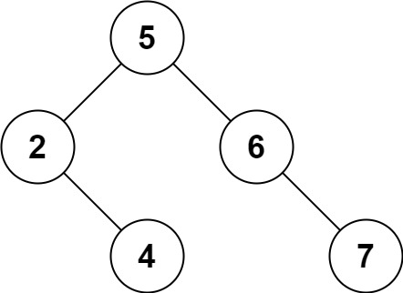

# [LeetCode #450 - Delete Node in a BST](https://leetcode.com/problems/delete-node-in-a-bst/)

**Difficulty: `Medium`**

---

Given a root node reference of a BST and a key, delete the node with the given key in the BST. Return the ***root node reference*** *(possibly updated) of the BST.*

Basically, the deletion can be divided into two stages:
1. Search for a node to remove.
2. If the node is found, delete the node.

### Example 1


Input: 
```
root = [5,3,6,2,4,null,7]
key = 3
```
Output: 
```
[5,4,6,2,null,null,7]
```

**Explanation:** Given key to delete is 3. So we find the node with value 3 and delete it.  
One valid answer is `[5,4,6,2,null,null,7]`, shown in the above BST.  
Please notice that another valid answer is `[5,2,6,null,4,null,7]` and it's also accepted.  


### Example 2

Input: 
```
root = [5,3,6,2,4,null,7]
key = 0
```
Output: 
```
[5,3,6,2,4,null,7]
```
**Explanation:** The tree does not contain a node with value = 0.


### Example 3

Input: 
```
root = []
key = 0
```
Output: 
```
[]
```

---

### Constraints
- The number of nodes in the tree is in the range `[0, 10^4]`.
- `-10^5 <= Node.val <= 10^5`
- Each node has a **unique** value.
- `root` is a valid binary search tree.
- `-10^5 <= key <= 10^5`

---

### Hints:
1. 


# [Solutions](https://github.com/Reddimus/LeetCode_Notes/tree/main/Trees/Medium/LC_450-Delete_Node_in_a_BST)

### Approach: 

### Intuition

### Steps
1. 

### Complexity Analysis
- **Time Complexity:** `O(
- **Space Complexity:** `O(

Where 

### Python Code:
```python
```

### C++ Code:
```cpp
```

### Java Code:
```java
```

### Approach: Iterative

### Intuition

### Steps
1. 

### Complexity Analysis
- **Time Complexity:** `O(log N) | O(H)`  
- **Space Complexity:** `O(1)`  

Where `N` is the number of nodes in the tree, `H` is the height of a reasonably balanced tree.

### Python Code:
```python
class Solution:
    def deleteNode(self, root: Optional[TreeNode], key: int) -> Optional[TreeNode]:
        # Find node to be deleted and its parent
        parent, node = None, root
        while node and node.val != key:
            parent = node
            if key < node.val:
                node = node.left
            else:
                node = node.right

        if not node:  # Node to delete not found
            return root

        # Case 1: Node with only one child or no child
        if not node.left or not node.right:
            new_node = node.left if node.left else node.right

            # Root is the desired node
            if not parent:  # Deleting the root node
                return new_node

            if parent.left == node:
                parent.left = new_node
            else:
                parent.right = new_node

        # Case 2: Node with two children
        else:
            min_parent, min_node = node, node.right

            # Find the minimum valued node in the right subtree
            while min_node.left:
                min_parent = min_node
                min_node = min_node.left

            # Reconnect min_parent to min_node child or del non-parent min_node
            if min_parent != node:
                min_parent.left = min_node.right
            else:
                min_parent.right = min_node.right

            # Replace node's value with its min_node's value
            node.val = min_node.val

        return root
```

### C++ Code:
```cpp
```

### Java Code:
```java
```
